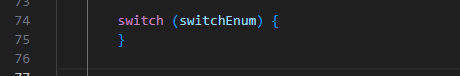
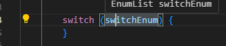
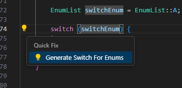
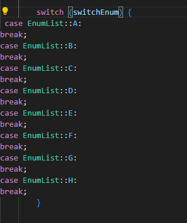
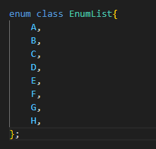

## Features

Add Code Action to create a case for every enum of the switch variable.

This adds every enum to the switch as individual cases, without checking to see if any have already been added.
Not recommended for adding to an existing switch statement, but rather for creating new switch statements. 

1) Set up the switch statement as shown Note: {} are not required for the code generator 

2) Move cursor to the variable in the switch

3) Either click the little lightbulb, or press the hotkey for "Code Actions" (ctrl + . On Windows)

4) Once you click 'Generate Switch For Enums", the switch statement should be populated with a case for each enum.

### 1.0.0
### 1.0.1

Initial release.